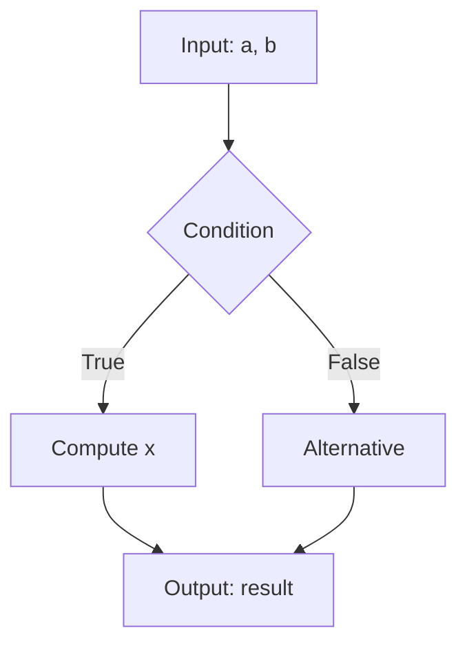
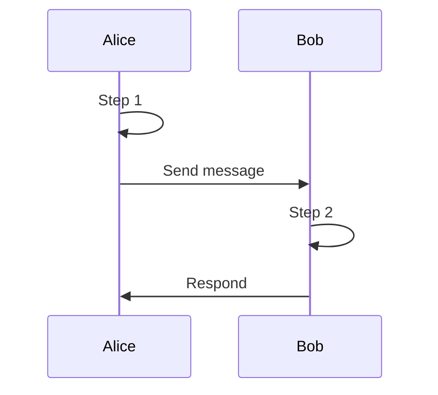
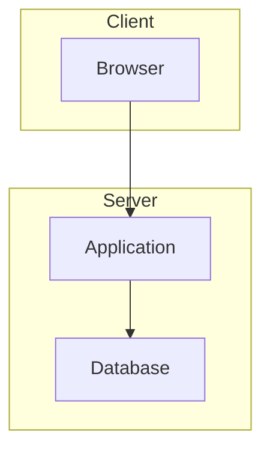

# Diagram Quick Reference Card
## Kriptografi Asimetrik E-Book

**Last Updated**: December 17, 2025

---

## 📊 Diagram Type Selector

| Need to show... | Use this tool | Template |
|----------------|---------------|----------|
| Algorithm steps | Mermaid flowchart | `flowchart TD` |
| Protocol exchange | Mermaid sequence | `sequenceDiagram` |
| System architecture | Mermaid graph | `graph TB` |
| Mathematical plot | Python matplotlib | `matplotlib-template.py` |
| EC visualization | Python matplotlib | `ec-plot-template.py` |
| Performance data | Python matplotlib | `bar-chart-template.py` |
| Process flow | Mermaid flowchart | `flowchart LR` |

---

## 🎨 Color Palette (Copy-Paste Ready)

### For Mermaid:
```mermaid
style NodeName fill:#1a5f7a,color:#fff
style NodeName fill:#57837b,color:#fff
style NodeName fill:#c4dfdf
style NodeName fill:#f26b60,color:#fff
style NodeName fill:#28a745,color:#fff
style NodeName fill:#ffc107
style NodeName fill:#dc3545,color:#fff
```

### For Python:
```python
COLORS = {
    'primary':    '#1a5f7a',  # Main elements
    'secondary':  '#57837b',  # Supporting
    'accent':     '#c4dfdf',  # Backgrounds
    'highlight':  '#f26b60',  # Important
    'success':    '#28a745',  # Correct/Valid
    'warning':    '#ffc107',  # Caution
    'danger':     '#dc3545',  # Error/Attack
}
```

### Usage Guide:
- **Primary** (#1a5f7a): Main boxes, key concepts
- **Secondary** (#57837b): Supporting info, decisions
- **Accent** (#c4dfdf): Backgrounds, highlights
- **Highlight** (#f26b60): Critical points, emphasis
- **Success** (#28a745): Correct answers, valid states
- **Warning** (#ffc107): Attention needed
- **Danger** (#dc3545): Errors, attacks, failures

---

## 📝 Naming Convention

```
chXX-figYY-description.ext

Examples:
✓ ch01-fig01-prime-distribution.png
✓ ch04-fig02-rsa-encryption-flow.mmd
✓ lab04-fig01-keygen-output.png

✗ figure1.png
✗ diagram_rsa.jpg
✗ image-001.png
```

---

## 🔧 Quick Start Templates

### Mermaid Flowchart
````markdown
```{mermaid}
%%| label: fig-unique-id
%%| fig-cap: "Your caption here"

flowchart TD
    A[Start] --> B{Decision?}
    B -->|Yes| C[Process]
    B -->|No| D[Alternative]
    C --> E[End]
    D --> E

    style A fill:#1a5f7a,color:#fff
    style E fill:#1a5f7a,color:#fff
    style B fill:#57837b,color:#fff
```
````

### Mermaid Sequence
````markdown
```{mermaid}
%%| label: fig-protocol
%%| fig-cap: "Protocol interaction"

sequenceDiagram
    participant Alice
    participant Bob

    Alice->>Bob: Message 1
    Bob->>Alice: Response
    Note over Alice,Bob: Shared state achieved
```
````

### Python Plot
```python
import matplotlib.pyplot as plt

COLORS = {'primary': '#1a5f7a'}

fig, ax = plt.subplots(figsize=(10, 6), dpi=150)

# Your plotting code here

ax.set_xlabel('X Label', fontweight='bold')
ax.set_ylabel('Y Label', fontweight='bold')
ax.set_title('Title', fontsize=14, fontweight='bold')
ax.grid(True, alpha=0.3, linestyle='--')

plt.tight_layout()
plt.savefig('filename.png', dpi=300, bbox_inches='tight')
```

---

## ✅ Pre-Flight Checklist

Before committing diagram:

- [ ] Follows naming convention (`chXX-figYY-description.ext`)
- [ ] Uses official color palette
- [ ] Has clear labels on all nodes/edges
- [ ] Includes `fig-cap` (caption)
- [ ] Includes `fig-alt` (accessibility)
- [ ] Saved with source file (.mmd, .py)
- [ ] PNG at 300 DPI minimum
- [ ] Tested in both HTML and PDF output
- [ ] Consistent with other chapter diagrams

---

## 📏 Size Standards

| Format | Width | Height | DPI | File Size |
|--------|-------|--------|-----|-----------|
| **Full width** | 1200-1600px | Variable | 300 | <500KB |
| **Half width** | 600-800px | Variable | 300 | <300KB |
| **Icon/Small** | 200-400px | 200-400px | 300 | <100KB |

---

## 🎯 Common Patterns

### Algorithm Walkthrough


### Protocol Steps


### System Architecture


---

## 🚀 Render Commands

```bash
# Render specific chapter
quarto render chapters/01-number-theory.qmd

# Render all
quarto render

# Preview with live reload
quarto preview

# Export diagrams only
python scripts/export-all-diagrams.py
```

---

## 🔗 Quick Links

- [Full Standards Doc](DIAGRAM_STANDARDS.md)
- [Mermaid Live Editor](https://mermaid.live/)
- [Color Contrast Checker](https://webaim.org/resources/contrastchecker/)
- [Matplotlib Gallery](https://matplotlib.org/stable/gallery/)

---

## 💡 Tips & Tricks

**Mermaid**:
- Use `%%` for comments
- Define styles at end of diagram
- Use `subgraph` for grouping
- `LR` = Left-to-Right, `TD` = Top-to-Down

**Python**:
- Always set `facecolor='white'` for consistency
- Use `bbox_inches='tight'` to remove whitespace
- DPI 300 for publication quality
- Close figures with `plt.close()` after saving

**General**:
- Keep diagrams simple (one concept)
- Use consistent spacing
- Label everything
- Test with color-blind simulator

---

## 📞 Need Help?

1. Check [DIAGRAM_STANDARDS.md](DIAGRAM_STANDARDS.md) for detailed guide
2. Look at existing examples in `images/chapters/`
3. Use templates in `images/templates/`
4. Ask in project discussion forum

---

**Quick Copy-Paste Snippet** (Mermaid in Quarto):

````markdown
```{mermaid}
%%| label: fig-CHANGEME
%%| fig-cap: "CHANGEME: Description"
%%| fig-alt: "CHANGEME: Accessibility description"

flowchart TD
    A[Start] --> B[End]

    style A fill:#1a5f7a,color:#fff
    style B fill:#1a5f7a,color:#fff
```
````
