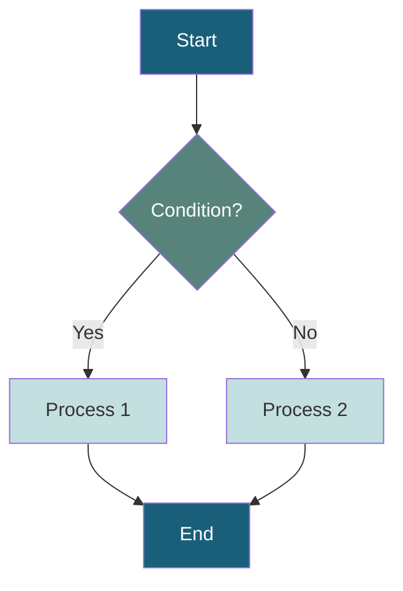
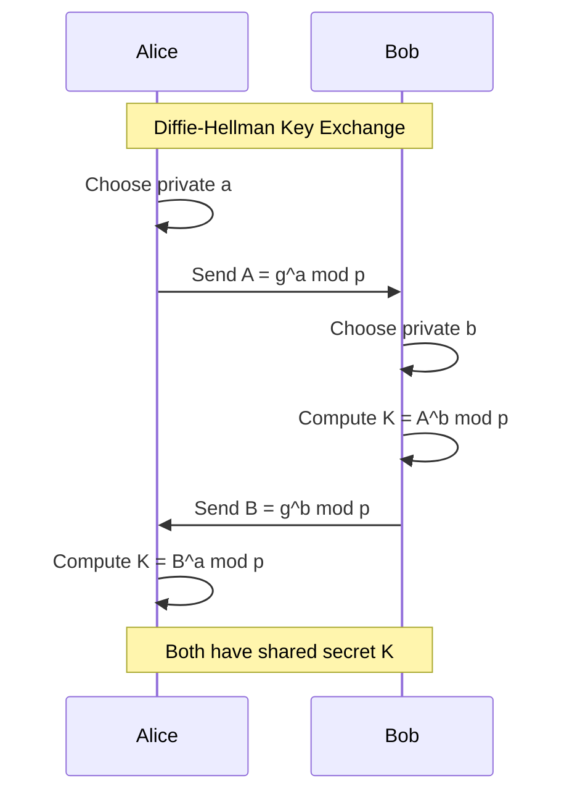
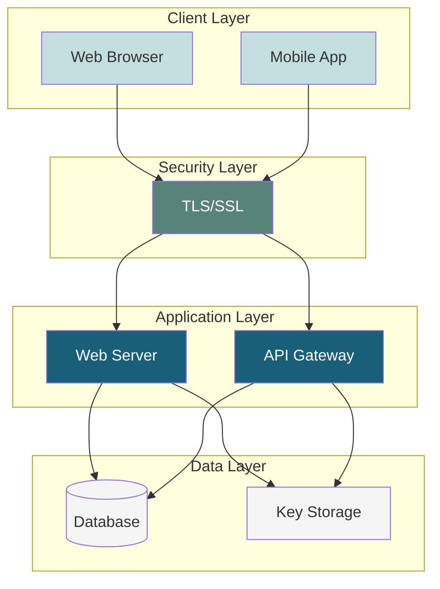
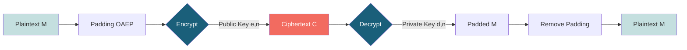
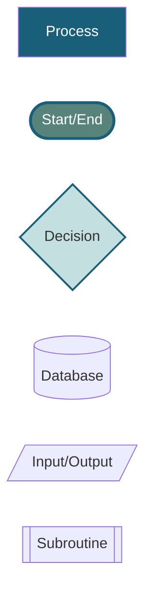
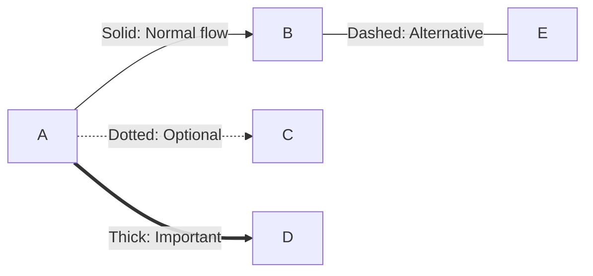
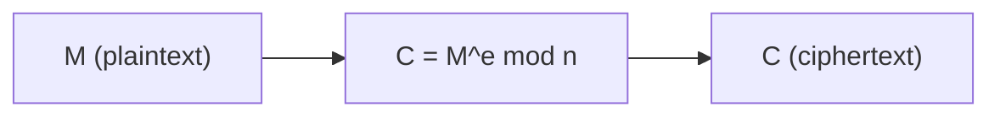
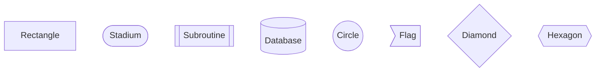

# Diagram Standards and Guidelines
## Kriptografi Asimetrik E-Book Project

**Version**: 1.0
**Last Updated**: December 17, 2025
**Purpose**: Standardize visual elements untuk konsistensi dan kualitas

---

## TABLE OF CONTENTS

1. [Overview](#1-overview)
2. [Diagram Types](#2-diagram-types)
3. [Tool Stack](#3-tool-stack)
4. [Visual Design Standards](#4-visual-design-standards)
5. [File Organization](#5-file-organization)
6. [Best Practices](#6-best-practices)
7. [Examples Gallery](#7-examples-gallery)
8. [Accessibility](#8-accessibility)

---

## 1. OVERVIEW

### 1.1 Diagram Inventory

Total target: **80+ diagrams** across all chapters

| Category | Count | Tools |
|----------|-------|-------|
| Flowcharts & Algorithms | 15 | Mermaid |
| Protocol Sequence Diagrams | 12 | Mermaid |
| Mathematical Visualizations | 20 | Python/matplotlib, TikZ |
| Architecture Diagrams | 10 | Mermaid, Draw.io |
| Elliptic Curve Plots | 8 | Python/matplotlib |
| Cryptographic Processes | 15 | Mermaid, TikZ |
| Performance Charts | 5 | Python/matplotlib |
| Miscellaneous | 5 | Mixed |

### 1.2 Design Philosophy

**Principles**:
1. **Clarity over complexity** - Simple, uncluttered designs
2. **Consistency** - Uniform color scheme, fonts, styles
3. **Accessibility** - Color-blind friendly, high contrast
4. **Pedagogical** - Support learning, not just decoration

---

## 2. DIAGRAM TYPES

### 2.1 Flowcharts (Algorithms)

**Purpose**: Visualize step-by-step processes

**Tool**: Mermaid (preferred), Graphviz (alternative)

**Standard Template**:


**When to use**:
- Algorithm walkthroughs (Euclidean, Extended GCD, etc.)
- Key generation processes
- Decision flows
- Attack scenarios

**Examples needed**:
- `ch01-fig02-euclidean-algorithm.mmd`
- `ch04-fig01-rsa-keygen.mmd`
- `ch06-fig03-dh-exchange.mmd`

---

### 2.2 Sequence Diagrams (Protocols)

**Purpose**: Show interaction between entities over time

**Tool**: Mermaid

**Standard Template**:


**When to use**:
- Protocol exchanges (DH, TLS handshake)
- PKI certificate chain validation
- Attack scenarios (MITM)

**Examples needed**:
- `ch06-fig01-diffie-hellman-sequence.mmd`
- `ch10-fig05-tls-handshake.mmd`
- `ch09-fig02-pki-validation.mmd`

---

### 2.3 Mathematical Visualizations

**Purpose**: Illustrate mathematical concepts

**Tool**: Python with matplotlib/seaborn

**Standard Template**:
```python
import matplotlib.pyplot as plt
import numpy as np

# Poltek SSN color scheme
COLORS = {
    'primary': '#1a5f7a',
    'secondary': '#57837b',
    'accent': '#c4dfdf',
    'highlight': '#f26b60'
}

fig, ax = plt.subplots(figsize=(8, 6), dpi=150)

# Your plotting code here

# Styling
ax.set_xlabel('Label', fontsize=12, fontweight='bold')
ax.set_ylabel('Label', fontsize=12, fontweight='bold')
ax.set_title('Title', fontsize=14, fontweight='bold', pad=20)
ax.grid(True, alpha=0.3, linestyle='--')
ax.spines['top'].set_visible(False)
ax.spines['right'].set_visible(False)

plt.tight_layout()
plt.savefig('filename.png', dpi=300, bbox_inches='tight')
plt.show()
```

**When to use**:
- Number distributions (primes, quadratic residues)
- Performance comparisons
- Security level charts
- Elliptic curve plots

**Examples needed**:
- `ch01-fig01-prime-distribution.py`
- `ch07-fig02-elliptic-curve-plot.py`
- `ch04-fig04-rsa-keysize-security.py`

---

### 2.4 Elliptic Curve Visualizations

**Purpose**: Show EC operations visually

**Tool**: Python matplotlib with custom EC library

**Standard Template**:
```python
import matplotlib.pyplot as plt
import numpy as np

def plot_elliptic_curve(a, b, p=None):
    """Plot y² = x³ + ax + b"""
    fig, ax = plt.subplots(figsize=(10, 8), dpi=150)

    if p is None:  # Real field
        x = np.linspace(-5, 5, 1000)
        y_pos = np.sqrt(x**3 + a*x + b)
        y_neg = -y_pos

        ax.plot(x, y_pos, color='#1a5f7a', linewidth=2, label='y² = x³ + {}x + {}'.format(a, b))
        ax.plot(x, y_neg, color='#1a5f7a', linewidth=2)
    else:  # Finite field
        # Plot points
        points = []
        for x in range(p):
            y_squared = (x**3 + a*x + b) % p
            for y in range(p):
                if (y**2) % p == y_squared:
                    points.append((x, y))

        if points:
            xs, ys = zip(*points)
            ax.scatter(xs, ys, color='#1a5f7a', s=50, alpha=0.7)

    ax.axhline(y=0, color='k', linewidth=0.5)
    ax.axvline(x=0, color='k', linewidth=0.5)
    ax.grid(True, alpha=0.3)
    ax.set_xlabel('x', fontsize=12, fontweight='bold')
    ax.set_ylabel('y', fontsize=12, fontweight='bold')
    ax.legend()

    return fig, ax

# Example usage
fig, ax = plot_elliptic_curve(a=-1, b=1)
plt.title('Elliptic Curve: y² = x³ - x + 1', fontsize=14, fontweight='bold')
plt.savefig('ch07-fig01-basic-ec.png', dpi=300, bbox_inches='tight')
```

**When to use**:
- Introducing EC concepts
- Point addition/doubling visualization
- Different curve shapes
- Finite field vs real field comparison

**Examples needed**:
- `ch07-fig01-ec-real-field.py`
- `ch07-fig03-point-addition.py`
- `ch07-fig05-ec-finite-field.py`

---

### 2.5 Architecture Diagrams

**Purpose**: System structure and components

**Tool**: Mermaid (C4 diagrams) or Draw.io

**Mermaid Template (C4-style)**:


**When to use**:
- PKI hierarchy
- TLS architecture
- Hybrid cryptosystem structure
- Certificate chain

**Examples needed**:
- `ch09-fig01-pki-hierarchy.mmd`
- `ch10-fig01-hybrid-crypto-arch.mmd`
- `ch10-fig03-tls-architecture.mmd`

---

### 2.6 Cryptographic Process Diagrams

**Purpose**: Show encryption/decryption/signing flows

**Tool**: TikZ (for LaTeX/PDF) or Mermaid (for HTML)

**Mermaid Template**:


**TikZ Template** (for PDF output):
```latex
\begin{tikzpicture}[
    node distance=2cm,
    box/.style={rectangle, draw, fill=blue!20, minimum width=2cm, minimum height=1cm},
    arrow/.style={->, thick}
]
    \node[box] (plain) {Plaintext};
    \node[box, right of=plain] (enc) {Encrypt};
    \node[box, right of=enc] (cipher) {Ciphertext};

    \draw[arrow] (plain) -- (enc);
    \draw[arrow] (enc) -- (cipher);
\end{tikzpicture}
```

**When to use**:
- RSA encryption/decryption
- Digital signature process
- ECDH key derivation
- Certificate signing

**Examples needed**:
- `ch04-fig02-rsa-encryption.mmd`
- `ch09-fig04-signature-process.mmd`
- `ch08-fig02-ecdh-derivation.mmd`

---

### 2.7 Performance/Comparison Charts

**Purpose**: Quantitative comparisons

**Tool**: Python matplotlib/seaborn

**Standard Template**:
```python
import matplotlib.pyplot as plt
import numpy as np

categories = ['RSA-1024', 'RSA-2048', 'RSA-4096', 'ECC-256', 'ECC-384']
times = [10, 45, 180, 5, 8]  # milliseconds

fig, ax = plt.subplots(figsize=(10, 6), dpi=150)

bars = ax.bar(categories, times, color=['#1a5f7a', '#1a5f7a', '#1a5f7a', '#57837b', '#57837b'])

# Highlight fastest
bars[3].set_color('#f26b60')

ax.set_ylabel('Time (ms)', fontsize=12, fontweight='bold')
ax.set_title('Key Generation Performance Comparison', fontsize=14, fontweight='bold', pad=20)
ax.grid(axis='y', alpha=0.3, linestyle='--')

# Add value labels on bars
for i, bar in enumerate(bars):
    height = bar.get_height()
    ax.text(bar.get_x() + bar.get_width()/2., height,
            f'{times[i]} ms',
            ha='center', va='bottom', fontweight='bold')

plt.xticks(rotation=45, ha='right')
plt.tight_layout()
plt.savefig('ch04-fig05-performance.png', dpi=300, bbox_inches='tight')
```

**When to use**:
- Algorithm performance
- Security level comparisons
- Key size vs speed trade-offs

**Examples needed**:
- `ch04-fig05-rsa-performance.py`
- `ch07-fig08-ecc-vs-rsa-comparison.py`
- `ch11-fig03-pqc-comparison.py`

---

## 3. TOOL STACK

### 3.1 Primary Tools

| Tool | Purpose | Installation | Export Format |
|------|---------|--------------|---------------|
| **Mermaid** | Flowcharts, sequences, diagrams | Built-in Quarto | SVG, PNG |
| **Python matplotlib** | Mathematical plots, charts | `pip install matplotlib` | PNG, SVG, PDF |
| **TikZ** | Complex mathematical diagrams | LaTeX package | PDF |
| **Draw.io** | Complex architecture (optional) | Desktop/web app | PNG, SVG |

### 3.2 Installation

```bash
# Python environment
pip install matplotlib seaborn numpy scipy

# For EC plotting
pip install ecpy

# For graph visualizations
pip install networkx

# Optional: Export tools
pip install plotly  # Interactive plots
pip install pygraphviz  # Advanced graphs
```

### 3.3 Mermaid in Quarto

**Direct embedding**:
````markdown
```{mermaid}
%%| label: fig-rsa-flow
%%| fig-cap: "RSA Encryption Flow"

flowchart LR
    A[Plaintext] --> B[Encrypt]
    B --> C[Ciphertext]
```
````

**External file**:
````markdown
```{mermaid}
%%| file: diagrams/ch04-rsa-flow.mmd
%%| label: fig-rsa-flow
%%| fig-cap: "RSA Encryption Flow"
```
````

---

## 4. VISUAL DESIGN STANDARDS

### 4.1 Color Palette

**Official Poltek SSN Colors**:

```scss
// Primary colors (dari custom.scss)
$primary:    #1a5f7a;  // Dark teal - Main elements
$secondary:  #57837b;  // Medium teal - Secondary elements
$accent:     #c4dfdf;  // Light teal - Backgrounds, highlights
$highlight:  #f26b60;  // Coral red - Important highlights
$success:    #28a745;  // Green - Success states
$warning:    #ffc107;  // Yellow - Warnings
$danger:     #dc3545;  // Red - Errors, critical

// Neutral colors
$gray-100:   #f8f9fa;
$gray-200:   #e9ecef;
$gray-300:   #dee2e6;
$gray-700:   #495057;
$gray-900:   #212529;
```

**Usage Guidelines**:

| Element | Color | Hex | Use Case |
|---------|-------|-----|----------|
| Main boxes/nodes | Primary | `#1a5f7a` | Key concepts, main flow |
| Secondary elements | Secondary | `#57837b` | Supporting info |
| Backgrounds | Accent | `#c4dfdf` | Highlights, callouts |
| Critical/Important | Highlight | `#f26b60` | Warnings, key points |
| Success/Correct | Success | `#28a745` | Correct answers, valid |
| Caution | Warning | `#ffc107` | Attention needed |
| Error/Attack | Danger | `#dc3545` | Attacks, failures |

### 4.2 Typography

**Fonts**:
- **Titles**: Source Sans Pro, Bold, 14-16pt
- **Labels**: Source Sans Pro, Regular, 10-12pt
- **Code/Math**: Source Code Pro, 10pt
- **Annotations**: Source Sans Pro, Italic, 9-10pt

**Font weights**:
- Headings: Bold (700)
- Body: Regular (400)
- Emphasis: SemiBold (600)

### 4.3 Shapes and Styles

**Mermaid Shapes**:


**Shape Usage**:
- **Rectangle**: Process, function, general node
- **Rounded rectangle**: Start/End points
- **Diamond**: Decisions, conditionals
- **Cylinder**: Databases, storage
- **Parallelogram**: Input/Output
- **Double rectangle**: Subroutines, modules

### 4.4 Line Styles



**Guidelines**:
- **Solid**: Standard flow
- **Dashed**: Alternative/optional paths
- **Dotted**: Weak relationships, suggestions
- **Thick/Double**: Emphasis, main path

### 4.5 Consistency Rules

1. **Node sizing**: Keep consistent across similar diagrams
2. **Spacing**: Minimum 2cm between nodes
3. **Arrow direction**: Left-to-right or top-to-bottom
4. **Alignment**: Grid-based alignment
5. **Labels**: Always label arrows with conditions/actions

---

## 5. FILE ORGANIZATION

### 5.1 Directory Structure

```
images/
├── chapters/
│   ├── ch01/
│   │   ├── fig01-prime-distribution.png
│   │   ├── fig02-euclidean-algorithm.mmd
│   │   ├── fig02-euclidean-algorithm.png  (rendered)
│   │   └── fig01-prime-distribution.py  (source)
│   ├── ch04/
│   │   ├── fig01-rsa-keygen.mmd
│   │   ├── fig02-rsa-encryption.mmd
│   │   └── ...
│   └── ...
├── labs/
│   ├── lab01/
│   └── ...
├── shared/
│   ├── icons/
│   └── logos/
└── templates/
    ├── mermaid-template.mmd
    ├── matplotlib-template.py
    └── tikz-template.tex
```

### 5.2 Naming Convention

**Format**: `chXX-figYY-description.ext`

**Components**:
- `ch01` - Chapter number (01-14)
- `fig01` - Figure number within chapter
- `description` - Kebab-case description
- `.ext` - File extension

**Examples**:
```
ch01-fig01-prime-distribution.png
ch04-fig02-rsa-encryption-flow.mmd
ch07-fig05-ec-point-addition.py
lab04-fig01-rsa-keygen-output.png
```

**Lab figures**:
```
labXX-figYY-description.ext
lab04-fig01-rsa-output.png
lab10-fig03-tls-handshake-capture.png
```

### 5.3 Source Files

**Keep source files** for all generated diagrams:
- `.mmd` for Mermaid diagrams
- `.py` for Python plots
- `.tex` for TikZ diagrams
- `.drawio` for Draw.io diagrams

**Version control**: All source files in Git, rendered outputs optional

---

## 6. BEST PRACTICES

### 6.1 General Guidelines

1. **Simplicity**: One concept per diagram
2. **Labels**: All nodes and edges labeled clearly
3. **Legends**: Include legends for colors/symbols when needed
4. **Captions**: Every figure has descriptive caption
5. **Alt text**: Accessibility descriptions for all images

### 6.2 For Mermaid Diagrams

```markdown
```{mermaid}
%%| label: fig-unique-id
%%| fig-cap: "Descriptive caption here"
%%| fig-alt: "Alternative text for screen readers"

flowchart TD
    %% Comments for complex parts
    A[Clear Label] --> B[Another Clear Label]

    %% Styling
    style A fill:#1a5f7a,color:#fff
```
```

**Best practices**:
- Use `%%` for comments
- Define styles at the end
- Use meaningful node IDs (not just A, B, C)
- Add spacing for readability

### 6.3 For Python Plots

```python
# ch04-fig05-rsa-performance.py
"""
Figure 4.5: RSA Key Generation Performance
Compares key generation time for different key sizes
"""

import matplotlib.pyplot as plt
import numpy as np

# Configuration
FIGSIZE = (10, 6)
DPI = 300
COLORS = {
    'primary': '#1a5f7a',
    'secondary': '#57837b',
    'accent': '#c4dfdf',
    'highlight': '#f26b60'
}

# Data
key_sizes = [1024, 2048, 3072, 4096]
gen_times = [10, 45, 120, 280]  # milliseconds

# Plotting
fig, ax = plt.subplots(figsize=FIGSIZE, dpi=DPI)

# ... plotting code ...

# Save
plt.savefig('ch04-fig05-rsa-performance.png',
            dpi=DPI,
            bbox_inches='tight',
            facecolor='white')
plt.close()
```

**Best practices**:
- Docstring at top explaining figure
- Configuration section
- DPI 300 for publication quality
- Close figure after saving
- White background for consistency

### 6.4 Mathematical Notation

**In diagrams**, use proper LaTeX notation:

**Good**:
```
C = M^e mod n
K = g^(ab) mod p
y² = x³ + ax + b
```

**Better** (with LaTeX in labels):


### 6.5 Accessibility

**Color blindness consideration**:
- Never use color alone to convey information
- Use patterns, shapes, labels
- Test with color-blind simulator

**Screen reader support**:
- Alt text for all images
- Describe what diagram shows, not just "diagram of X"
- Include textual explanation in caption

**Example**:
````markdown
```{mermaid}
%%| label: fig-rsa-flow
%%| fig-cap: "RSA encryption process showing plaintext being padded with OAEP, then encrypted using public key (e,n) to produce ciphertext"
%%| fig-alt: "Flowchart with three boxes connected by arrows: Plaintext M, Padding OAEP, Encrypt with public key, resulting in Ciphertext C"

flowchart LR
    A[Plaintext M] --> B[Padding OAEP]
    B --> C[Encrypt]
    C --> D[Ciphertext C]
```
````

---

## 7. EXAMPLES GALLERY

### 7.1 Chapter 1: Number Theory

**Figure 1.2: Euclidean Algorithm**
````markdown
```{mermaid}
%%| label: fig-euclidean-algo
%%| fig-cap: "Euclidean Algorithm untuk GCD(48, 18)"

flowchart TD
    A[Start: a=48, b=18] --> B{b = 0?}
    B -->|No| C[r = a mod b]
    C --> D[a = b, b = r]
    D --> B
    B -->|Yes| E[Return a]

    style A fill:#1a5f7a,color:#fff
    style E fill:#1a5f7a,color:#fff
    style B fill:#57837b,color:#fff
    style C fill:#c4dfdf
    style D fill:#c4dfdf
```
````

### 7.2 Chapter 4: RSA

**Figure 4.1: RSA Key Generation**
````markdown
```{mermaid}
%%| label: fig-rsa-keygen
%%| fig-cap: "Proses Key Generation RSA"

flowchart TD
    A[Start] --> B[Pilih prima p, q]
    B --> C[Hitung n = p × q]
    C --> D[Hitung φ = p-1 × q-1]
    D --> E[Pilih e: gcd = 1]
    E --> F[Hitung d: ed ≡ 1 mod φ]
    F --> G{Valid?}
    G -->|No| E
    G -->|Yes| H[Public: e, n]
    H --> I[Private: d, n]
    I --> J[End]

    style A fill:#1a5f7a,color:#fff
    style J fill:#1a5f7a,color:#fff
    style G fill:#57837b,color:#fff
    style H fill:#28a745,color:#fff
    style I fill:#dc3545,color:#fff
```
````

### 7.3 Chapter 6: Diffie-Hellman

**Figure 6.1: DH Key Exchange**
````markdown
```{mermaid}
%%| label: fig-dh-exchange
%%| fig-cap: "Diffie-Hellman Key Exchange Protocol"

sequenceDiagram
    participant A as Alice
    participant E as Eve (Eavesdropper)
    participant B as Bob

    Note over A,B: Public: p (prime), g (generator)

    A->>A: Choose secret a
    A->>E: A = g^a mod p
    E->>B: A = g^a mod p

    B->>B: Choose secret b
    B->>E: B = g^b mod p
    E->>A: B = g^b mod p

    A->>A: K = B^a mod p = g^(ab) mod p
    B->>B: K = A^b mod p = g^(ab) mod p

    Note over A,B: Shared Secret: K = g^(ab) mod p
    Note over E: Eve knows g, p, A, B<br/>but cannot compute g^(ab)
```
````

### 7.4 Chapter 7: Elliptic Curves

**Figure 7.1: Elliptic Curve Plot**
```python
# ch07-fig01-ec-plot.py
import matplotlib.pyplot as plt
import numpy as np

# Curve: y² = x³ - x + 1
a, b = -1, 1

fig, ax = plt.subplots(figsize=(10, 8), dpi=150)

x = np.linspace(-2, 2, 1000)
y_pos = np.sqrt(x**3 + a*x + b + 0j).real
y_neg = -y_pos

# Filter real values only
mask = np.abs((x**3 + a*x + b)) >= 0
x_filtered = x[mask]
y_pos_filtered = y_pos[mask]
y_neg_filtered = y_neg[mask]

ax.plot(x_filtered, y_pos_filtered, color='#1a5f7a', linewidth=2.5,
        label=f'y² = x³ + {a}x + {b}')
ax.plot(x_filtered, y_neg_filtered, color='#1a5f7a', linewidth=2.5)

# Highlight specific points
points = [(0, 1), (1, 1)]
for px, py in points:
    ax.plot(px, py, 'o', color='#f26b60', markersize=10, zorder=5)
    ax.annotate(f'P({px},{py})', (px, py), xytext=(10, 10),
                textcoords='offset points', fontsize=10, fontweight='bold')

ax.axhline(y=0, color='k', linewidth=0.5, alpha=0.5)
ax.axvline(x=0, color='k', linewidth=0.5, alpha=0.5)
ax.grid(True, alpha=0.3, linestyle='--')
ax.set_xlabel('x', fontsize=12, fontweight='bold')
ax.set_ylabel('y', fontsize=12, fontweight='bold')
ax.set_title('Elliptic Curve: y² = x³ - x + 1', fontsize=14, fontweight='bold', pad=20)
ax.legend(fontsize=11)
ax.set_xlim(-2, 2)
ax.set_ylim(-3, 3)

plt.tight_layout()
plt.savefig('ch07-fig01-ec-plot.png', dpi=300, bbox_inches='tight', facecolor='white')
plt.show()
```

---

## 8. ACCESSIBILITY

### 8.1 Alt Text Requirements

**Format**: Describe the **content and purpose**, not just the type

**Bad**:
```
fig-alt: "Diagram of RSA encryption"
```

**Good**:
```
fig-alt: "Flowchart showing RSA encryption process: plaintext is padded using OAEP scheme, then encrypted with public key (e,n) using modular exponentiation to produce ciphertext"
```

### 8.2 Color Contrast

**WCAG AA Standards**:
- Normal text: Minimum contrast ratio 4.5:1
- Large text: Minimum contrast ratio 3:1

**Test combinations**:
```
Primary (#1a5f7a) on White (#ffffff): 7.2:1 ✓
Secondary (#57837b) on White: 5.1:1 ✓
Accent (#c4dfdf) on Primary: 8.5:1 ✓
```

**Tool**: Use [WebAIM Contrast Checker](https://webaim.org/resources/contrastchecker/)

### 8.3 Alternative Representations

For complex diagrams, provide:
1. **Alt text**: Brief description (1-2 sentences)
2. **Long description**: Detailed explanation in text
3. **Table equivalent**: For data diagrams
4. **Step-by-step text**: For process diagrams

---

## 9. CHECKLIST

Before finalizing any diagram:

- [ ] **Clarity**: Single concept, uncluttered
- [ ] **Colors**: Uses official palette
- [ ] **Labels**: All nodes/edges labeled
- [ ] **Caption**: Descriptive figure caption
- [ ] **Alt text**: Accessibility description
- [ ] **Filename**: Follows naming convention
- [ ] **Source file**: Saved in repository
- [ ] **Resolution**: PNG at 300 DPI minimum
- [ ] **Format**: SVG where possible for scalability
- [ ] **Consistency**: Matches style of other diagrams
- [ ] **Testing**: Renders correctly in HTML and PDF

---

## 10. APPENDIX

### 10.1 Quick Reference

**Mermaid Cheatsheet**:


**Color Palette CSS**:
```css
:root {
    --primary: #1a5f7a;
    --secondary: #57837b;
    --accent: #c4dfdf;
    --highlight: #f26b60;
    --success: #28a745;
    --warning: #ffc107;
    --danger: #dc3545;
}
```

### 10.2 Resources

**Tools**:
- [Mermaid Live Editor](https://mermaid.live/)
- [Draw.io](https://app.diagrams.net/)
- [Python matplotlib gallery](https://matplotlib.org/stable/gallery/)
- [TikZ examples](https://tikz.net/)

**Color Tools**:
- [Coolors.co](https://coolors.co/) - Palette generator
- [ColorBrewer](https://colorbrewer2.org/) - Color-blind safe palettes
- [WebAIM Contrast Checker](https://webaim.org/resources/contrastchecker/)

**Learning**:
- [Mermaid Documentation](https://mermaid-js.github.io/mermaid/)
- [Matplotlib Tutorials](https://matplotlib.org/stable/tutorials/)
- [Quarto Diagrams Guide](https://quarto.org/docs/authoring/diagrams.html)

---

**END OF DOCUMENT**
